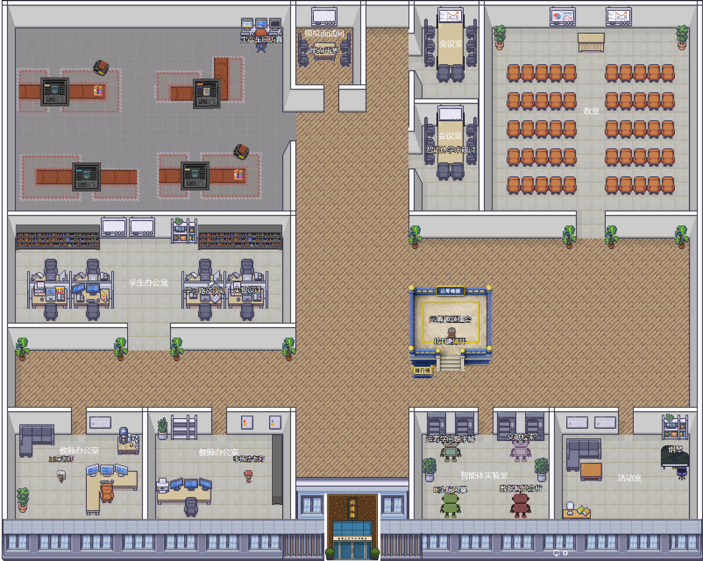

# ThisIsMyDepartment.AI

A self-hostable virtual department environment with identity-aware avatars, shared spaces, real-time multiplayer, and role-based AI characters.

Built for teams, labs, schools, and organizations that want a Gather-style virtual campus they fully own and turn into something useful: a help desk, teaching space, onboarding environment, project room, or public demo venue.

> **Quick start:** [doc/getting-started.md](doc/getting-started.md)



## What It Is Good For

This project is most useful when AI characters are attached to a place or a role rather than treated as generic chatbots.

Strong fits:

* **Department concierge** -- guide visitors, answer common questions, and route people to the right room or person
* **Course office hours** -- let students walk up to a teaching assistant or course guide in context
* **Lab onboarding** -- place safety, equipment, and process guidance directly inside the virtual environment
* **Project rooms** -- combine shared presence, chat, dashboards, and a persistent project assistant in one space
* **Open house or exhibition demos** -- give each room or booth an AI host that explains what is there and what to do next

The app can also spawn an offline user's configured AI stand-in, but that is best treated as an optional async handoff feature, not the main product story.

## Features

* **Virtual 2D world** -- pixel-art campus environment where users move, meet, and interact in real time
* **Identity and authentication** -- pluggable auth via shared-secret POST, JWT, reverse-proxy headers, or iframe/popup postMessage bridge; includes a built-in fallback login page for development
* **Persistent profiles** -- avatar appearance, display names, and user preferences stored server-side in SQLite
* **Role-based AI characters** -- LLM-powered NPCs that roam the world, respond to conversations, and can represent rooms, services, courses, or absent teammates; supports OpenAI, OpenRouter, and a mock provider for offline development
* **Real-time multiplayer** -- integrated Socket.IO room server for avatar movement, chat, and presence sync
* **Activity logging** -- server-side logging of chat messages, room joins, avatar changes, and iframe usage
* **Conversation storage** -- persistent player-to-player and player-to-AI chat history
* **Embedded content** -- iframe-based interactables for embedding external tools and dashboards
* **Voice and video** -- Jitsi integration for proximity-based audio/video chat and screensharing (requires a Jitsi Meet server)
* **Electron support** -- can be packaged as a desktop app via Electron Forge
* **Self-hostable** -- MIT-licensed, no external service dependencies beyond an optional LLM provider

## Demo In 5 Minutes

If you want to show why this project matters, demo it in this order:

1. **Enter a persistent shared space** -- show that this is not just a chat app; users occupy rooms and move through a virtual environment.
2. **Talk to a room-specific AI character** -- use a course guide, lab helper, or concierge instead of a generic personal clone.
3. **Open an embedded tool or presentation** -- connect the character to a dashboard, slide deck, or form inside the same environment.
4. **Move to a second room with a different role** -- show that the environment supports multiple specialized agents, not one monolithic assistant.
5. **Show the offline stand-in feature last** -- position it as a convenience for async coverage or handoff when a person is away.

This ordering makes the value proposition legible: space + roles + persistent context first, personal stand-ins second.

## Architecture Overview

The app has two runtime parts:

| Component | Default Address | Role |
|-----------|----------------|------|
| **Frontend** | `http://127.0.0.1:8000` | Browser client: 2D world, UI, avatar rendering |
| **Backend** | `http://127.0.0.1:8787` | Auth, profiles, persistence, AI chat routing, Socket.IO room server |

Both are required. The frontend dev server proxies `/api`, `/auth`, and `/socket.io` requests to the backend during local development.

```text
Browser Client (port 8000)
    |
    |-- /api/*          --> Backend (port 8787): bootstrap, profiles, agents, conversations
    |-- /auth/*         --> Backend (port 8787): login, handoff, session management
    |-- /socket.io/*    --> Backend (port 8787): real-time room sync (Socket.IO)
    |-- Jitsi (optional)--> External Jitsi server: voice/video
```

## Quick Start

Prerequisites: [Node.js](https://nodejs.org/) (v16.20.2 for the frontend toolchain, v20+ for the backend; see [doc/getting-started.md](doc/getting-started.md) for details).

```sh
git clone https://github.com/MINDS-THU/ThisIsMyDepartment.AI.git
cd ThisIsMyDepartment.AI
npm install
npm run compile
npm run server:build
npm run server:start     # terminal 1: starts backend on port 8787
npm start                # terminal 2: starts frontend on port 8000
```

Then open `http://127.0.0.1:8000/` in your browser. The built-in login page appears in development mode. After signing in and choosing an avatar, you enter the virtual world.

For detailed setup including Node version management, environment configuration, and troubleshooting, see [doc/getting-started.md](doc/getting-started.md).

## Documentation

| Document | Description |
|----------|-------------|
| [doc/getting-started.md](doc/getting-started.md) | Installation, first run, daily development workflow |
| [doc/auth-integration.md](doc/auth-integration.md) | Connecting an upstream SSO or login system |
| [doc/hosting.md](doc/hosting.md) | Production deployment with Nginx, reverse proxy, and TLS |
| [doc/current-status.md](doc/current-status.md) | What is implemented, what is incomplete, known constraints |
| [doc/product-roadmap.md](doc/product-roadmap.md) | Suggested 6-week roadmap to make the project more useful and easier to demo |
| [doc/feature-spec.md](doc/feature-spec.md) | Product and engineering spec for role-based AI spaces, demos, and grounded assistants |
| [doc/lighting.md](doc/lighting.md) | Tiled map editor lighting layer setup |
| [CHANGELOG.md](CHANGELOG.md) | Release history |
| [SECURITY.md](SECURITY.md) | Security policy and vulnerability reporting |

Configuration templates:

* [.env.example](.env.example) -- frontend runtime variables (Jitsi, backend URL)
* [server/.env.local.example](server/.env.local.example) -- backend variables for local development
* [server/.env.production.example](server/.env.production.example) -- backend variables for production

## AI Characters

There are two distinct AI character modes in this project:

1. **Environment avatars** -- deployment-owned characters such as course teachers, room guides, concierges, or project assistants.
2. **Offline user stand-ins** -- a user's own configured character persona, used when that user is offline and someone summons their stand-in.

For most deployments, environment avatars should be the primary experience because they are easier to trust, easier to scope, and easier to demo.

AI-controlled characters are defined as `*.agent.ts` files under `src/main/agents/`. Each file exports a definition with a display name, sprite, position, walk area, and system prompt.

Example (`src/main/agents/or-teacher.agent.ts`):

```ts
import type { LLMAgentDefinition } from "./AgentDefinition";

const orTeacherAgent: LLMAgentDefinition = {
    id: "ORTeacherBot",
    agentId: "or-teacher-bot",
    displayName: "Demo Teacher",
    spriteIndex: 4,
    position: { x: 400, y: 200 },
    caption: "Press E to chat",
    systemPrompt: "You are a virtual teaching assistant. Be helpful and patient.",
    walkArea: { x: 400, y: 200, width: 100, height: 100 }
};

export default orTeacherAgent;
```

Chat is routed through the backend. Provider credentials stay server-side. Configure the LLM provider with environment variables:

| Variable | Description |
|----------|-------------|
| `TIMD_AGENT_LLM_PROVIDER` | Force a provider: `openrouter`, `openai`, or `mock` |
| `OPENROUTER_API_KEY` | OpenRouter API key (preferred if set) |
| `OPENAI_API_KEY` | OpenAI API key (fallback if OpenRouter is not set) |
| `OPENROUTER_MODEL` / `OPENAI_MODEL` | Model override (defaults to `gpt-4.1-mini`) |

When neither API key is configured, the backend falls back to mock mode.

For a stronger deployment, avoid generic prompts and instead create characters that represent a room, a workflow, or an institutional role with bounded responsibilities.

## Modifying the Scene

Install [Tiled](http://www.mapeditor.org/) and open `assets/map/map.tiledmap.json`. Edit the tilemap, save, and recompile the frontend. See [doc/lighting.md](doc/lighting.md) for lighting layer setup.

## Testing

```sh
npm test              # spell check + lint + Jest suite
npm run check         # Jest only
npm run smoke:realtime  # Socket.IO multiplayer contract tests
```

The realtime smoke test requires a running backend. See [doc/getting-started.md](doc/getting-started.md#realtime-smoke-test) for details.

## Repository Layout

```text
src/                  Frontend TypeScript sources
src/main/agents/      AI character definitions (*.agent.ts)
src/engine/           Reusable game engine primitives
server/src/           Backend TypeScript sources
server/data/          SQLite database (created at runtime)
assets/               Sprites, maps, sounds, fonts
scripts/              Build and test utilities
doc/                  Project documentation
lib/                  Compiled frontend output (generated)
server/dist/          Compiled backend output (generated)
```

## Contributing

Contributions are welcome. Please open an issue before submitting large changes.

* Follow the formatting and style conventions described in [AGENTS.md](AGENTS.md)
* Run `npm test` before submitting a pull request
* See [CODE_OF_CONDUCT.md](CODE_OF_CONDUCT.md) for community guidelines

## License

[MIT](LICENSE) -- Copyright MINDS-THU 2026

## Current Limitations

These areas are still in progress:

* role-based agents are more compelling than offline stand-ins, but the default seeded demos do not yet fully reflect that
* agent replies are currently prompt-and-history driven; they do not yet have first-class document grounding, room knowledge packs, or tool execution
* broader provider support beyond the current mock and OpenAI paths
* deeper modernization of the legacy frontend and Socket.IO stack
* final public repository metadata, maintainer details, and release packaging polish
* broader testing and packaging polish for Electron distribution
